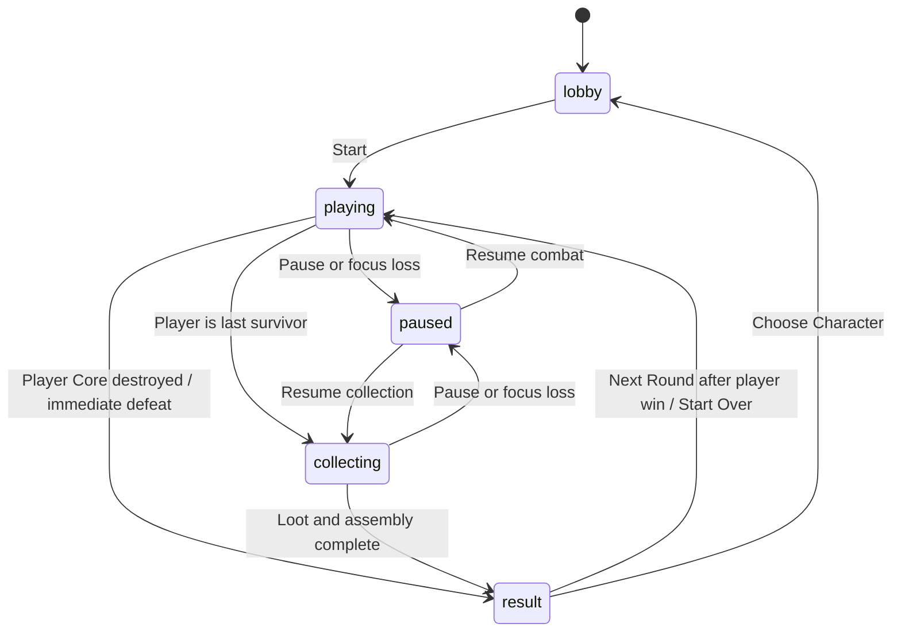

# Architecture

Reviewed against **v2 Battle Royal patch** on 2026-10-09 (package metadata `0.1.0`). The browser entry point uses `BattleRound`: one player and three bots. Legacy duel constructors remain for compatibility scenarios; they are not a selectable lobby mode. See [Release notes](RELEASE_NOTES.md).

## Runtime boundaries

| Module | Responsibility |
| --- | --- |
| [main.ts](../src/main.ts) | DOM input, four live actors, fixed-step battle orchestration, shots, debris, elimination, immediate defeat and result flow |
| [types.ts](../src/game/types.ts) | Pieces, structures, templates, evolution state, damage and attachment contracts |
| [structure.ts](../src/game/structure.ts) | Face geometry, Core connectivity, random damage/cascades, safe deterministic ammunition detachment, bounds and legacy attachment |
| [ammunition.ts](../src/game/ammunition.ts) | Transfer a bounded reserve-first batch of safe non-Core inventory parts into one volley |
| [projectiles.ts](../src/game/projectiles.ts) | Packed real-part volleys, damage from actual count, continuous age, boundary arcs and clear landing search |
| [battle-combat.ts](../src/game/battle-combat.ts) | Earliest swept contact across eligible hostile actors and remaining cover; independent default for legacy callers |
| [arena.ts](../src/game/arena.ts) | Procedural buildings, floor-supported demolition, cached remaining footprints, swept movement/shot cover |
| [movement.ts](../src/game/movement.ts) | Normal movement, arena bounds, dash duration and recharge |
| [bots.ts](../src/game/bots.ts) | Styles/opening tiers, bounded preparation, hunting/finishing/recovery goals, cover clearing/flanking and threat evasion |
| [bot-squad.ts](../src/game/bot-squad.ts) | Round alliances, shared hostile targets, attached-health hysteresis and immediate attack-slot replacement |
| [rounds.ts](../src/game/rounds.ts) | Battle participants, last survivor, fallen reserves, exact continuation, opponent queues; retained duel APIs |
| [evolution.ts](../src/game/evolution.ts) | Immutable plans, repair/build frontier, reserve assembly and phase transition |
| [rune.ts](../src/game/rune.ts) | Combat-time center rune, deterministic contact winner and one-time installed palette restoration |
| [pickup.ts](../src/game/pickup.ts) | Settled/age eligibility, all-owner fired lock, proximity-based contested batches |
| [debris.ts](../src/game/debris.ts) | Render dimensions, landing height and spatially indexed pile support |
| [victory.ts](../src/game/victory.ts) | Bounded reward attraction/collection and assembly, fired lock, phase transition and completion |
| [render.ts](../src/render.ts) | Instanced characters/buildings/debris, exact-part projectile visuals, camera, pointer projection and stock trays |
| [ui.ts](../src/ui.ts) | Lobby, aligned player/stock and action columns, native shot-count control, pause/reward/results |

Pure game modules have no DOM or WebGL dependencies. The renderer uses Three.js; the entry point connects rule functions with views and input.

## State and coordinates

A `Piece` is one axis-aligned box with ID, local minimum-corner position, dimensions, color, and shape. Pieces remain distinct inventory objects through firing, damage, pickup, assembly, and banking. Ordinary transfer preserves color; a collected rune intentionally changes installed colors without changing identity or geometry. A `Structure` holds an attached map, Core ID, revision, round-start baseline, exposure flag, and optional evolution state.

Local character/building geometry is in studs; rendering and collision multiply by `CONFIG.characterScale = 0.5`. Actor/building X/Z coordinates and projectile motion are world units. Character presentation offsets its lowest attached Y to ground level. Movement and combat are planar; actor collision is a circle, while building collision follows the remaining axis-aligned brick footprint.

`BattleRound` contains the number, selected player/template, four `BattleParticipant` records, and an opponent queue. Each participant has a stable actor ID (`player`, `bot-1` through `bot-3`), its template/structure, and optional bot style/difficulty. Fresh pieces receive round/actor namespaces. Buildings receive `arena-round-N/building-M/piece-K` IDs. Player survivor IDs stay intact across continuation.

`PartProjectile` owns an array of 1–20 exact removed pieces, actual-count damage, packed collision radius, owner ID, world position/velocity, continuous age, mode (`shot` or `rebound`), and settlement state. Its `piece` alias remains the first part for older handwritten fixtures. One volley resolves one nearest contact and becomes separate drops preserving every part and the shared age. `lockedUntilAge = 5` identifies fired-part recovery rules.

The read-only `window.__arenaSnapshot` summarizes fighters, alive count, placement, winner, building revisions/counts, projectile-group counts, shot-count setting, rune clock/state, drops, combat events, input, statistics, and draw calls. Its `mass` counts attached parts, all stock, standing buildings, world drops, and all active projectile parts. It is a QA diagnostic rather than a save/control API.

## Battle and phases

`newBattleRound()` creates the selected player and three fresh bots. `beginRound()` resets prior views, input, shots, debris, rune availability/clock, timers and statistics; spawns four corners at ±36% of arena width/depth; generates the 160 × 160 map; and seeds 24 opening drops.

`battleWinner()` returns a participant only when exactly one Core survives. `playerBattleOutcome()` separately returns defeat as soon as the player's Core is absent, or victory when the player is the sole survivor. `releaseEliminatedReserve()` drains a fallen inventory once into contested world loot. Bot elimination stops that actor; player elimination immediately enters `result`, clears held input and freezes simulation. Placement remains diagnostic data; the defeat UI shows no placement or invented winner.

At either outcome every active projectile becomes a drop with its continuous fired age and `lockedUntilAge = 5` preserved. Lethal player damage exits further combat processing immediately, preventing later contacts or timers from advancing. The result freezes actors, drop ages, rune time and inputs even if several bots remain. A winning player instead enters loose reward collection; standing buildings stay standing and are excluded from rewards.

`nextBattleRound()` requires the player to be the winner. It deep-copies the survivor, evolution occupation/history and reserve; resets the Core baseline/revision; and creates three fresh base opponents with new namespaces. The entry point regenerates the map and resets motion, cooldowns and statistics. Restart creates round 1 from the base head. Settings remain page-local; reload loses the run.

`newRound()`, `nextRound()`, and `RoundState` are retained duel APIs used by older structural/progression tests. They do not define the current main-loop roster.

## Simulation and input

The RAF loop accumulates fixed 1/60-second simulation steps; frame delta is capped at 0.1 seconds. Pause returns before simulation-time updates. Each combat step updates cooldowns/bounds, projects aim, moves the living player and bots, resolves cover continuously, separates living actors, handles nearest projectile contacts, checks the player outcome, then advances debris and eligible collection only if combat is still active.

Movement is smoothed, normalized and arena-clamped. Base player speed is 19.8375 and base bot speed is 15.20875 before difficulty modifiers, a 15% increase over the preceding build for both normal movement and dash. Space requests one direction-locked 0.18-second dash at 3.3 times speed, with a 2.4-second recharge. The pre-movement position is passed to `resolveArenaBuildings()` so fast movement cannot cross a wall between frames. Inward velocity is removed while parallel motion slides along faces. Cover resolution is repeated after actor separation. Growth depenetration refreshes nearby boxes after each displacement and respects arena bounds. If local pushes cannot resolve overlap, it verifies the reserved center, moves there, and stops velocity. Repeated stationary resolution then remains stable.

Pointer picking targets a living actor's planar center when its body is hit; a building hit uses its world cover geometry, and other pointers project onto the aiming plane. Mouse and touch drive the same aim/fire path. Physical key codes preserve bindings across keyboard layouts. Blur/hidden-tab pause clears held input; input fields and menu activation retain normal keyboard behavior. `onShotCountChange()` updates a page-local requested batch size, default 1. The native 1–20 range stops gameplay pointer/keyboard propagation while retaining normal range keys; `onDash()` provides an accessible touch/mouse button. The action panel is disabled outside live player combat.

## Ammunition, contact and recovery

`takeAmmunitionBatch()` requests up to 20 real pieces by repeating `takeAmmunition()`, which transfers the first eligible reserve part, excluding the designated Core. With no stock, `detachAmmunitionPiece()` uses a deterministic graph-derived safe order that removes one non-Core piece without disconnecting survivors. It invalidates geometry/slot caches, records the vacated slot, and can expose the Core. Firing has no damage cascade. A bare Core cannot fire. A shortage returns a smaller batch; damage is exactly its length, so no independent power setting can outpace spent inventory.

Each shot group keeps every source ID, dimension, color and shape. Deterministic compact offsets pack the mesh parts without resizing them; swept radius derives from the packed horizontal extent. `firstBattleImpact()` compares cover contacts and live non-owner actor-circle contacts and chooses the earliest fraction. Equal actor/cover contacts favor cover. Actor damage uses the existing random eligible batch and Core cascade; terrain damage uses local impact selection and floor connectivity.

After one impact every spent part becomes its own debris drop with its packed offset. A missed shot reaching a boundary switches to a ballistic transport arc; this mode cannot damage actors/buildings. It selects a clear interior footprint, tries a deterministic fallback search, and retains the part airborne if no safe target exists. No lifetime timeout deletes inventory.

Projectile age runs continuously from firing through impact, rebound and landing. All collectors require a fired part to settle and reach age five. The lock persists in victory collection. Ordinary damage debris instead uses the 0.8-second shared age and five-second last-owner combat delay.

## Color rune

`RuneState` tracks combat elapsed time, the next 30-second interval, availability and spawn/collection counts. `stepRune()` is called only during live combat; pause, immediate defeat, result and collection phases freeze this clock. An available rune remains until collection and additional intervals do not stack cubes. `collectRune()` filters living fighters touching center within body radius plus 2.5, then picks nearest center distance and actor ID deterministically.

`restoreModelColors()` paints installed slots once per pickup. Head slots use the selected original head palette; body slots use `evolution-colors.generated.json`, exported from authored zones with dark clothing, silver details and a path accent. Only piece colors and the render revision change. Core state, IDs, sizes/positions/shapes, missing slots, stock, drops and shots are preserved. Future loot keeps its own color. The center cube has a separate renderer group and is reset with each new battle.

## Procedural cover

`generateArenaBuildings(random, roundNumber)` mixes walls, tall hollow towers, ragged ruins, stairs and arches. Dimensions, heights, quarter-turn orientation, brick packing, colors and world placement vary. Twenty buildings form peripheral clusters between four diagonal spawn-to-center routes. Each route reserves a radius of 26 (width 52), clearing the largest authored 24.2-radius full form with margin. Radius-expanded segment checks reserve the whole connection and spawn endpoint, so the center is a safe growth fallback. Pieces use compatible small 1–2 stud footprints and 0.4/1.2 heights.

Construction is anchored to every brick touching local Y = 0. Its structural Core field is only a reference; it has no actor exposure/elimination behavior. `damageArenaBuilding()` removes an impact-local patch, traverses from all surviving floor bricks, drops unsupported sections, increments revision, and updates bounds. Grounded fragments remain independently supported.

Collision unions deduplicate projected bricks and merge rectangles only when their union is rectangular, preserving holes. Footprints are cached by structure revision. Face graphs are created lazily on first damage and reused across removal. Sweeps use box faces and round corners for actual circle geometry. Demolished openings affect movement, dash, projectile and bot line-of-fire queries.

## Bots, pickup and victory

Opening tiers are preserved: easy Balanced bots in round 1, medium Balanced in round 2, then independently sampled full-strength styles. `coordinateBotSquad()` runs once before the bot loop, issuing read-only orders. Round 1 has four independent teams; round 2 allies bot-1/bot-2 with a shared hostile target and three-second commitment; from round 3 every bot allies against the player. The main loop filters allied opponents and projectile threats. `firstBattleImpact()` accepts an optional hostility predicate, preserving the independent default for older callers; the runtime also guards `hit()` against allied damage.

From round 4 the squad keeps two healthy attackers and one collector, with different attack flanks. Attached count at or below 65% of its actual attained peak triggers recovery; a healthy collector replaces the attacker in that same decision. At 90% restored count, recovery ends without displacing a stable healthy pair. Peak excludes reserve, and permanent Core exposure alone cannot trap a repaired bot in recovery. Dead members are removed, and round/time/structure resets clear old decisions. Coordination changes no inventories or exposure flags.

Resource preparation ends after gaining four reserve parts, six net parts, or six combat seconds. Explicit intents (`prepare`, `hunt`, `finish`, `recover`, `collect`, `harvest`, `clear`, `flank`, `evade`) make the current decision observable. `thinkBattleBot()` accepts an optional squad order after its compatible random argument; it scores hostile opponents for vulnerability, proximity and visibility, respects shared targets and priority roles, evaluates exact-size repair/growth stock and danger, harvests cover for resources, and routes around the exact union of surviving brick footprints, including demolished gaps. Footprint geometry is cached by revision; a cached sparse visibility graph connects expanded footprint corners with arena-edge/center anchors. Bounded neighbor discovery and memoized visibility keep repeated detours manageable, while graph stamps include the current body radius and footprint signature.

Movement edges use swept clearance for the whole body radius. With ammunition, the bot checks the attack line for actual shot-blocking cover and can shoot the first obstruction even when a route exists; reaching a safe route proxy is insufficient if the rival remains hidden. When no shot obstruction exists but routing fails, a separate body-width query identifies cover that leaves a shooting lane too narrow to traverse. Loot approaches target reachable points inside the pickup circle, including precise boundary approaches; missing or stalled approaches are deferred for eight simulation seconds or until cover revision changes. Routes refresh with goals, footprint changes or radius changes, and preserve a 0.1-unit arena-edge margin, with stuck recovery and threat evasion. The older duel decision API remains testable compatibility code.

Hunting uses a short target lock, with immediate switching for decisive finishing chances and deferral of stale or unreachable targets. Worthwhile loot approaches have their own lock; automatic pickups already in range do not divert an ongoing hunt. Scarce stock can favor a cheap local flank before spending it on cover. Moving targets receive interception aim, and packed shot radius is checked against the actual opening before firing.

Bot attack batches account for available safe ammo, target hit confidence, health, finishing opportunities and incoming volleys. A stocked bot does not spend body pieces merely to fill its desired batch. Threat scoring uses actual packed projectile width and viable incoming contacts. Pressure-driven retreat reports `evade`; longer engagements apply bounded pressure so resource gathering cannot indefinitely postpone attack.

Each bot owns a `DashState`. AI requests require readiness and a complete cover/edge-safe segment; `moveDashingBody()` shares the player's direction-lock, 0.18-second duration, 3.3 multiplier and 2.4-second recharge with a supplied movement speed. Continuous building resolution follows movement. Pause freezes all dash states; elimination/results stop active bursts, and restart recreates them. Later stocked combat, or non-collector/non-recovering body fire at health ≥68% or a viable finishing blow, can request a 0.23-second shot interval. Body batch budgets remain unchanged. `fire()` enforces that minimum for everyone without panic-based cooldown resets. Snapshot fighters expose team, role, desired/actual shot count, shot and dash counters, and independent dash state for browser QA.

All living fighters use one nearest-first contested pickup scheduler with at most eight world pickups and a separate bounded stock assembly pass per step. Eligibility respects landing, age, ownership and fired locks. Valid pieces without an exact connected plan slot are banked. Dead fighters cannot collect. Spatial pile support keeps landed debris from occupying the same rendered height.

Victory attraction processes up to 16 incoming and separately 16 reserve parts per step. Ordinary debris bypasses combat eligibility; fired parts still require settlement and age five. Pending drop ages continue during collection. Once loot and stock assembly finish, an eligible phase-2 body can rebuild into phase 3 using existing parts. Result waits for completion and the 2.4-second minimum. See [Evolution](EVOLUTION.md).

## Rendering and limits

Characters and neutral buildings use instanced brick views; buildings hide actor Core/ring decoration. Projectile meshes contain every real part in one compact group. Multi-part group orientation stays fixed so packed offsets agree with collision and landing geometry; single-part visuals may spin. Debris/character buffers expand without truncating logical inventory. The player Backpack shares the arena WebGL context and samples up to 240 parts; its count remains exact. Its container/stage are transparent so the shared scissor-rendered model remains visible behind the DOM; only its header/footer have opaque white backgrounds.

At viewport widths above 1280 pixels and heights of at least 600 pixels, desktop HUD columns use equal `clamp(280px, 17vw, 336px)` widths and equal heights anchored to the projected outer arena base. Both use 44/56 card rows with an upper minimum of 280 pixels, reduced to 260 pixels at widths 1281–1440. Segoe UI/Arial numbers are 52–60 pixels, headings 24–28 and captions 16–18. Player build/Core and evolution/repair/growth sit above Backpack; DASH sits above the 1–20 parts control. Rival stock/cards, time/round/alive counters and pickup-report toasts are absent. Repair/growth totals remain in the player card. Smaller windows use compact columns; portrait keeps a 76-pixel Backpack preview, while short touch landscape and fine-pointer windows at heights of 500 pixels or less show its header/count. The short fine-pointer layout starts at Y = 64.

Camera framing includes living actors and remaining cover. `resize()` reads canvas CSS dimensions and horizontal sidebar/action bounds; HUD top/height do not feed camera framing. `frame()` updates the stable camera pose and world matrix, projects the outer base corners, then publishes half-pixel-rounded `--arena-hud-top` and `--arena-hud-height` only when they change. Camera shake is applied afterward, so it does not move the HUD. Compact/preview layouts remove those anchors. Resize refreshes pixel density with a 1.75 DPR cap; CSS coordinates and shared stock scissor rectangles remain in CSS pixels.

Rendering, adaptive framing and circular actor bounds are approximations rather than a full physics engine. The live game uses `Math.random()`; pure APIs accept injected random sources for tests. There is no serialization/network synchronization boundary. Current tests establish correctness/capacity, not sustained GPU frame rate.
