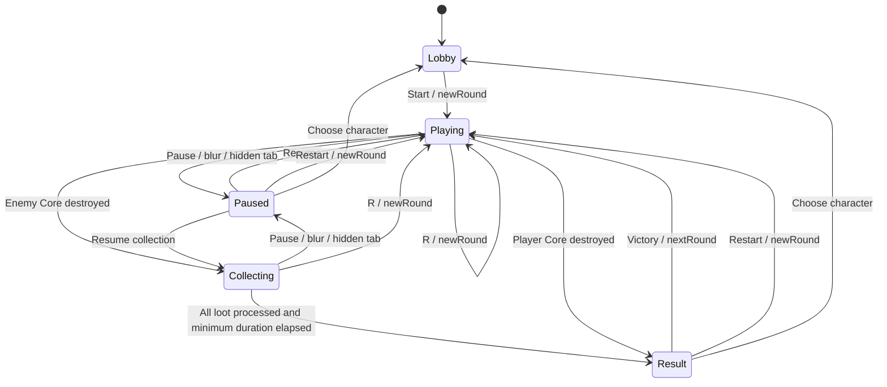

# Architecture

Reviewed against version `0.1.0` on 2026-10-05. See [Product requirements](../PRD.md) for player-facing rules and [Development](DEVELOPMENT.md) for tuning values.

## Runtime boundaries

The application is a static browser client. `index.html` supplies `#app` and `#arena`; `src/main.ts` creates the renderer, sound service, UI, and animation loop. There is no application server, database, network protocol, or saved game state.

The structural modules operate on plain TypeScript data without a DOM or WebGL context. `main.ts` orchestrates these rules with input, AI, world positions, and rendering. The offline generator is separate from the runtime import graph: the browser imports its generated JSON through `src/assets/templates.ts`.

| Source | Responsibility |
| --- | --- |
| [src/main.ts](../src/main.ts) | Phase state, actors, input, simulation, bot, shots, debris, particles, statistics, diagnostic snapshot |
| [src/game/types.ts](../src/game/types.ts) | Piece, template, structure, damage, attachment, and random-source contracts |
| [src/game/config.ts](../src/game/config.ts) | Shared prototype constants |
| [src/game/structure.ts](../src/game/structure.ts) | Cloning, Core connectivity, damage, repair vacancies, attachment, bounds |
| [src/game/pickup.ts](../src/game/pickup.ts) | Eligibility, footprint-based reach, candidate ordering, batching, failed-placement cache |
| [src/game/movement.ts](../src/game/movement.ts) | Smoothed movement, dash duration/direction/cooldown, arena bounds |
| [src/game/bots.ts](../src/game/bots.ts) | Bot styles, loot targets, evasion, predictive aim and firing cadence |
| [src/game/victory.ts](../src/game/victory.ts) | Post-combat attraction, bounded attachment batches, completion and skipped loot |
| [src/game/collision.ts](../src/game/collision.ts) | First swept segment/circle contact in X/Z |
| [src/game/rounds.ts](../src/game/rounds.ts) | New runs, victory carryover, opponent queues, spawn ID namespaces |
| [src/render.ts](../src/render.ts) | Arena, fixed camera, pointer projection, character instances, projectile visuals |
| [src/ui.ts](../src/ui.ts), [src/style.css](../src/style.css) | DOM screens, roster, HUD, dialogs, responsive presentation |
| [src/sound.ts](../src/sound.ts) | Local sample fetch/decode/playback, synthesized cues, mute |
| [src/assets/catalog.ts](../src/assets/catalog.ts) | Character order, names, subtitles, accents, portrait paths |
| [scripts/generate-templates.ts](../scripts/generate-templates.ts) | Offline PNG-to-template conversion and diagnostics |

## Data model and coordinates

`Vec3` contains numeric `x`, `y`, and `z` fields. Piece coordinates are local minimum corners in stud units; `size` contains positive dimensions along the same axes. Actor positions use world X/Z coordinates. Attached geometry is normally scaled by `CONFIG.characterScale = 0.5`; the lobby preview uses scale 1.

| Type | Fields and role |
| --- | --- |
| `Piece` | `id`, `position`, `size`, `color`, and `shape` (`brick`, `plate`, `tile`, or `slope`) |
| `CharacterTemplate` | `id`, `name`, `subtitle`, `accent`, `coreId`, `pieces`, and provenance `source` URL |
| `Structure` | `pieces: Map<string, Piece>`, `coreId`, `vacancies: Piece[]`, `revision`, `roundStartPieces`, `coreExposed` |
| `DamageResult` | Distinct `direct` and `cascade` piece arrays plus `eliminated` |
| `AttachmentResult` | Attached `piece` and `mode: repair` or `growth` |
| `RoundState` | Number, selected player/enemy templates, both structures, remaining opponent IDs, `enemyBehavior`, and `enemyDifficulty` |
| `PickupState` | Last `ownerId` or `null`, simulation `age`, and `settled` |
| `DashState` | Active burst time, recharge time, and locked planar direction |
| `BotState` | Behavior style/difficulty, current tactic, decision/wander timers, movement direction, dodge duration, and dodge cooldown |
| `BotAction` | Movement/speed, aim, firing decision/interval, dodge flag, and sniper panic flag |
| `VictoryCollection` | Pending drop references, elapsed reward time, total, collected, and skipped counts |

`Actor`, `Shot`, `Drop`, `Particle`, and `Stats` are private runtime interfaces in `main.ts`. Actors combine a structure with a `CharacterView`, planar position/velocity, cooldown, hurt feedback, and cached bounds. Shots reference their owner and track planar motion, lifetime, and mesh. Drops retain the detached piece and add ownership, age, falling height/velocity, and rotation.

There is no shared `attached/flying/falling/ground` enum on `Piece`. Membership in the structure or drop array, together with `settled`, expresses that lifecycle. Projectiles are not body pieces. A vacancy is an empty geometric box stored using the `Piece` shape; it is not a collectible object or a required original piece identity.

`createStructure()` deep-copies positions and sizes, validates finite positive geometry and unique nonempty IDs, and requires the Core ID to exist. It does not validate all overlaps or initial connectivity. The supplied assets are checked separately during generation and by tests.

## Phase and round lifecycle

`showPreview()` clears the run and creates a base-character preview. `beginRound()` clears old views, projectiles, debris, particles, held keys, and firing state; creates both actors; resets fight statistics and simulation time; and seeds 24 neutral drops.

`newRound()` validates the roster, clones both base structures, and creates a shuffled opponent queue excluding the selected character. Spawned IDs are namespaced, for example `round-1/player/violet-0151` and `round-2/enemy/flare-0000`. Both round constructors call `botForRound()`: round 1 assigns `balanced/easy`, round 2 assigns `balanced/medium`, and later rounds independently sample one of four styles at `normal` difficulty. Styles may repeat; the character queue's no-repeat rule is separate.

`nextRound()` requires the player's Core to exist and the enemy's Core to be absent. It deep-copies the attached survivor and vacancies, preserves IDs and the Core, resets its revision, and sets a new protection baseline from the actual piece count. It creates a fresh enemy with a new round namespace. Queue reshuffling avoids a repeat across cycle boundaries.

Damage power and mute are page-level variables. They survive new fights and lobby transitions. The selected template remains the basis for restarting and for excluding opponents, even when the survivor contains foreign pieces.

`GameUI` also retains the selected card and roster page across screen transitions. Pagination only changes visible cards. Selecting a card changes the preview; it does not start a fight. Returning to the lobby resets its scroll position but does not reset those selections or the synchronized damage sliders. Reloading reconstructs all state from defaults.

## Simulation and input

`requestAnimationFrame` measures wall-clock time and clamps each frame delta to 0.1 seconds. An accumulator runs `tick(1 / 60)` at a fixed simulation step. Rendering runs once per animation frame and the DOM HUD refreshes approximately every 0.15 seconds. There is no interpolated physics frame or deterministic replay system.

While playing, each tick:

1. Advances elapsed time, cooldowns, and hurt timers; refreshes actor bounds if a structure revision changed.
2. Projects pointer aim, starts a requested dash when ready, moves the player, and fires if the button is held and cooldown permits.
3. Updates the bot and separates overlapping actors, then clamps them to arena bounds.
4. Advances projectiles and resolves swept hits; a lethal hit ends active combat immediately.
5. Advances debris physics and runs automatic pickup if still playing.

Pause returns before simulation time advances and resumes the prior combat or collection phase. Victory freezes fight time, clears shots, and runs `stepVictoryCollection()` until all remaining drops are attempted and the minimum celebration duration has elapsed. Normal drop physics and ownership timers do not govern this reward stage. The result phase advances any rejected debris without collecting it. Drawing still runs in all phases; particle updates are suppressed during pause. Toast removal uses a wall-clock DOM timeout and is independent of simulation time.

Movement normalizes nonzero input and exponentially smooths velocity. Collision radius uses 44% of the largest horizontal span after character scaling, with minimum and arena-size caps. Pickup uses a separate radius based on the farthest absolute X/Z extents plus reach, so the two radii serve different purposes.

Shots are checked against the opponent only. `segmentCircleHit()` returns the first contact fraction from 0 to 1, or `null`. It handles initial overlap and zero-length segments. It sweeps the shot against the target's current center, not a full moving-target trajectory.

Pointer rays use the actual canvas rectangle. A ray hitting the opponent's instanced body maps aim to that actor's planar center; otherwise it intersects the Y = 3.2 aiming plane and is clamped to the arena. Rendered yaw and individual brick geometry do not define projectile collision.

### Browser input routing

The window key handlers store `KeyboardEvent.code` values, so controls follow physical key positions across keyboard layouts. The lobby bypasses game shortcuts. Events targeting `input`, `select`, or `textarea` also bypass them; Space/Enter on a `button`, `a`, or `summary` retain native behavior. Otherwise WASD, arrows, and Space suppress default browser behavior. Repeat events can maintain the held-key set but cannot activate another dash, pause, restart, or mute action.

Only a left-button `pointerdown` on the canvas while playing starts fire and attempts an immediate shot. Window-level `pointermove` updates aim, and `pointerup` clears firing even outside the canvas. Pause, blur, and round cleanup clear held keys, firing, and queued dash input. `beginRound()` and resume focus the canvas. R restarts from any non-lobby phase; P/Escape only toggle playing/collecting and paused; M works outside the lobby subject to the focus guards above.

## Dash and bot decisions

`movement.ts` separates movement math from DOM input. Space queues a single dash request; key-repeat events do not queue additional bursts. Activation normalizes movement input or falls back to aim, locks that direction for 0.18 seconds, and starts a 2.4-second recharge. Burst speed is 3.3 times normal player speed. Arena clamping still applies, firing remains available, and no invulnerability flag is set. Each new fight creates fresh dash state.

`bots.ts` exposes four styles: `aggressor`, `collector`, `sniper`, and `balanced`. `BOT_DIFFICULTIES` adjusts decision intervals, movement speed, firing intervals, aim spread/lead, and dodge probability. Decisions refresh every 0.42 seconds on easy, 0.24 on medium, or 0.12 at normal difficulty. Wandering targets refresh every 2–4 seconds. Aggressors prioritize closing distance and nearby loot; collectors score eligible loot by distance and enemy risk; snipers seek distance, strafe, and predict player motion. Full-strength sniper panic shortens the firing interval to 0.12 seconds, including the current runtime shot cooldown when necessary.

The Balanced style chooses a new tactic when its wander timer refreshes: collect with probability 0.35, approach with probability 0.30, or strafe with probability 0.35. Collection considers eligible pieces with a distance-plus-risk score below 24 and only pursues them when the player is beyond `contact + 4`. Without such a target, it approaches/strafe-retreats around a medium range. Its base firing interval is `CONFIG.botShotInterval`, without sniper panic.

Collectors, snipers, and Balanced bots examine approaching projectile trajectories up to 0.7 seconds ahead and can dodge for 0.28 seconds. A wall check can reverse the dodge direction. Easy difficulty disables dodging; medium allows a detected-threat attempt with probability 0.55; normal allows it whenever eligible. Balanced bots set a 1.1-second retry cooldown when detecting a threat, even if the probability check rejects that attempt. Aggressors never dodge. Base bot speed is multiplied by 1.12 for aggressors or by 1.22 during evasion, then by the difficulty speed factor. `main.ts` applies the resulting movement, aim, and firing decisions to live actors; rule tests exercise these decisions separately from browser input and rendering.

Behavior distances use `contact = 0.8 * (player.radius + enemy.radius)`. Collector retreat starts below `max(18, contact + 8)`; sniper preferred range is `max(28, contact + 12)` and panic starts below `max(15, contact + 5)`. This lets the same rules react to larger mutants. All bots receive passive pickup through the shared collector loop, even when their movement does not target loot. They never invoke `startDash()`.

Aim prediction uses `min(0.85, distance / projectileSpeed)` seconds, multiplied by 1 for snipers or 0.55 for other styles, then by the difficulty lead factor. Base oscillating X/Z spread has amplitude 0.8 for aggressors, 1.8 for collectors, 1.3 for Balanced bots, and 0.3 for snipers; panic reduces the sniper base spread to zero. Difficulty spread is added afterward. These offsets describe the current aiming heuristic, not guaranteed accuracy. Style parameters, difficulty factors, and firing ranges are documented in [Development](DEVELOPMENT.md).

## Victory collection

On a win, `finish()` clears projectiles, stops actor motion and the player's dash, freezes combat time, and creates a `VictoryCollection` over all current drops. `stepVictoryCollection()` uses a separate elapsed timer; ordinary drop physics and age updates stop during this phase.

After 0.3 seconds, pending pieces move toward `(player.x, 2.5, player.z)` at an increasing speed of `35 + elapsed * 32`. Pieces within 0.8 world units receive a placement attempt, up to 16 attempts per step. Combat pickup eligibility and the failed-placement cache are bypassed; attachment still uses the normal repair/growth API. Success removes the drop and updates reward and fight statistics. Failure leaves the drop in the world but removes it from the pending set, so it is not retried. A missing player Core or full 16,000-piece structure skips the remaining pending pieces.

Completion requires an empty pending set and at least 2.4 seconds elapsed, even when there is no debris. Bounds are refreshed as the winner grows. The result then exposes Next Round; that transition copies the completed survivor and vacancies and discards any skipped world debris. Defeat skips this reward phase entirely.

## Structural geometry and caches

`structure.ts` treats every shape as an axis-aligned box. Intersections require positive overlap on all axes; connections require one shared face and positive overlap on the other two axes. Comparisons use `EPSILON = 1e-6`. Shape metadata does not alter structural collision.

A `SpatialIndex` uses 2-stud buckets for local neighbor queries. Pieces spanning more than 512 buckets go into a separate large-piece list; queries spanning more than 4,096 buckets fall back to scanning the indexed pieces. This limits bucket allocation for unusually large geometry.

A module-level `WeakMap` caches the spatial index and Core-connected component per structure revision. Core connectivity is discovered by breadth-first traversal. There is no permanently stored adjacency graph or public voxel occupancy map. `connectedToCore()` returns a copy of the cached ID set.

Changes must keep `revision` and cached geometry consistent. Use the structural APIs instead of directly changing map entries or nested positions: direct mutation without invalidation can leave connectivity, bounds, and rendering stale. Damage invalidates or refreshes its caches; attachment incrementally extends the index and connected set.

## Damage and attachment APIs

`damageStructure(structure, power, rng)` sanitizes finite power to a nonnegative integer and caps it by the eligible piece count. It samples without replacement, removes the whole direct batch, computes the Core component, detaches the remainder, records vacancies, and increments the revision once for a nonempty operation.

Core eligibility is captured before removal. Exposure uses `max(1, floor(roundStartPieces * (1 - coreProtectionLoss) + EPSILON))` and is sticky for the rest of the fight. Missing Core means an empty connected component and elimination. Zero/invalid power leaves an otherwise unchanged structure at the same revision.

`attachPiece(structure, incoming, rng)` returns an attachment or `null`. It first searches shuffled compatible vacancies, then shuffled faces of connected anchors. Candidate positions align an incoming face to an anchor and use edge/center offsets. This is a finite candidate search, not a general packing solver. It preserves incoming orientation and dimensions.

The placement must remain at Y ≥ 0, avoid solid overlap, and contact the Core-connected component. Successful attachment clones geometry, keeps or suffixes the incoming ID, subtracts occupied volume from vacancies, increments the revision, and extends cached connectivity. Face-adjacent vacancies merge only when they form an exact rectangular union; partial repairs leave rectangular fragments.

`attachPiece()` itself has no 16,000-piece cap. The live limit is enforced by `collectNearbyDrops()` and `stepVictoryCollection()`. Tooling that calls the attachment API directly is responsible for its own capacity policy.

## Pickup scheduling

`collectNearbyDrops()` builds eligible drop/collector pairs within each collector's radius, sorts by squared distance, and processes them with per-collector batch counts. A set prevents duplicate collection. It compacts the ground array once after successful attachments.

Failed placements are cached in a nested weak map keyed by drop, structure, and revision. Unchanged geometry does not repeatedly retry the same rejection. Ownership, age, Core existence, and the live piece cap are checked separately. Candidate distances/radii are a snapshot for that call; growth affects the next bounds refresh.

There is no explicit tie-break rule beyond candidate enumeration/stable sorting. Do not depend on equal-distance contested pickups as a fairness mechanism.

## Rendering, UI, and audio

`CharacterView` uses separate instanced meshes for boxes and studs. It rewrites instance matrices/colors only when the structure revision changes. Capacities start at 512 bodies and 2,048 studs and grow to the next power of two. Tiles and slopes omit studs; all bodies use box geometry, so stored slopes do not produce curved slope meshes. The current Mini assets contain bricks, plates, and tiles.

Detached pieces are boxes in one preallocated instanced mesh. It holds `2 * maxPieces + 64` drops (32,064 with current settings). Hit/pickup/result particles use another instanced mesh with capacity 500; spawning stops at 450 active particles. Reaching the drop cap prevents additional detached pieces from being added as debris.

`ArenaRenderer` owns one orthographic camera, lights, arena meshes, pointer projection, and hit shake. Framing depends on canvas dimensions, with a separate lobby target/scale. Device pixel ratio is capped at 1.75. The UI reparents the same canvas; `ResizeObserver` and window resize events update its size. No WebGL renderer is created per preview card.

`GameUI` creates DOM markup once and delegates events to callbacks. It manages screen visibility, six-item roster pages, focus cycling in dialogs, selected-card state, sliders, and toasts. There is no UI framework, router, or localization layer. Most strings live in `ui.ts`, with additional messages in `main.ts`, bot labels in `bots.ts`, metadata in `index.html`, and subtitles in the catalog.

`setScreen()` reparents `#arena` between the lobby preview and root, updates its tab index, and marks the top bar inert during pause/results. The HUD remains present behind those modal overlays. The collecting screen adds reward progress and hides dash/toast displays through CSS. Result rendering makes Next Round hidden/disabled on defeat and promotes Restart to the primary button; focus moves to the visible enabled primary action on the next animation frame. Tab/Shift+Tab cycle between visible modal controls, including the pause settings summary/input.

Victory progress is `collected / total`, with an empty arena displayed as complete. Skipped pieces are not counted as collected, so a finished reward phase can end below 100%; completion is decided by the pending set and elapsed time, not the progress bar. Toasts are created only while playing, limited to three, and removed after 2.1 wall-clock seconds. They are hidden during collecting, pause, and results.

`Sound` fetches three local samples during lobby initialization. A user gesture creates/resumes `AudioContext`, then decodes buffers once. Sample sounds pass through a compressor; pickup/win/loss sounds use oscillators. Loading errors are logged and missing combat samples are skipped. Sound and mute state are not persisted.

## Practical limits

The runtime uses `Math.random()` for combat, placement, opponents, AI, and cosmetic effects. Pure rule functions accept injected random sources for tests, but the complete game is not deterministic. There is no serialization or network synchronization boundary.

Large mutants increase geometry, candidate searches, pointer raycasting, and rendering cost. The test suite verifies correctness and instance capacity, not a guaranteed frame rate. The fixed camera and approximate circular actor collision also limit how closely very large asymmetric bodies match their visible footprint. See [Testing](TESTING.md) for evidence and manual checks.
